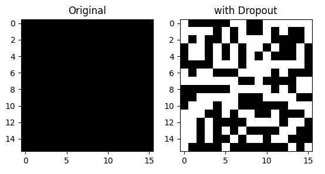
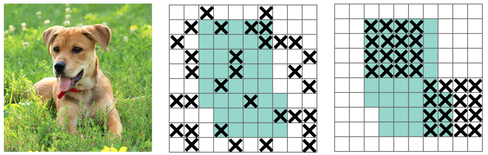
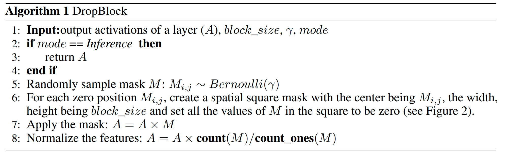
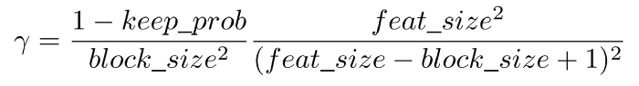
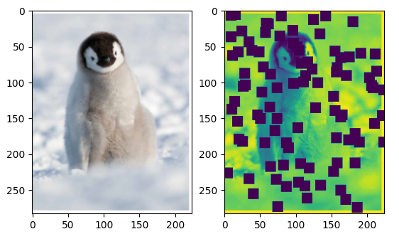
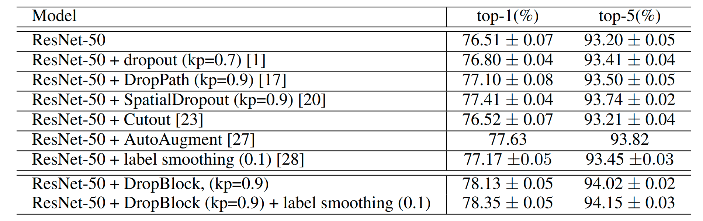

# DropBlock: A Better Dropout for CNN’s

Dropout is a regularization technique for neural network models proposed by Srivastava, et al. in their 2014 paper [Dropout: A Simple Way to Prevent Neural Networks from Overfitting.](http://jmlr.org/papers/v15/srivastava14a.html)

Dropout is a technique where randomly selected neurons are ignored during training. They are “dropped-out” randomly. This means that their contribution to the activation of downstream neurons is temporally removed on the forward pass and any weight updates are not applied to the neuron on the backward pass.

This is how the standard Dropout looks like:

```python

import torch
from torch import nn
import matplotlib.pyplot as plt

x = torch.ones((1, 1, 16, 16))
dropout = nn.Dropout()

dropped = dropout(x)

fig, axs = plt.subplots(1, 2)

axs[0].imshow(x.squeeze(0).permute(1,2,0).numpy(), cmap='gray')
axs[1].imshow(dropped.squeeze(0).permute(1,2,0).numpy(), cmap='gray')

axs[0].set_title('Original')
axs[1].set_title('with Dropout')

plt.show()
```


Random pixels were indeed dropped, and that’s exactly the issue.

By randomly dropping independent pixels, we’re not removing semantic information contained in the image, because nearby activations contain closely related information.

# Introducing DropBlock
The paper explains how they managed to solve this problem by dropping contiguous regions from a feature map of a layer instead of dropping out independent random units.


The algorithm works as follows:


# DropBlock implementation
DropBlock has two main parameters which are block_sizeand γ. block_sizeis the size of the block to be dropped, and γ controls how many activation units to drop.
```python
import torch
from torch import Tensor, nn

class DropBlock(nn.Module):
    def __init__(self, block_size: int, p: float = 0.5):
        self.block_size = block_size
        self.p = p # keep_prob, like Dropout
```

We now need to compute gamma, which controls the features to drop.

The idea is to keep every activation with `p` prob, so we can sample from a Bernoulli distribution with mean `1 - p` , like in Dropout.
This is how gamma is computed:


You’ll notice, the left ratio in the multiplication represents the number of units that will be set to zero, while the right-hand one is the valid region, the number of pixels not touched by DropBlock, that we want to keep.

```python

class DropBlock(nn.Module):
    def __init__(self, block_size: int, p: float = 0.5):
        self.block_size = block_size
        self.p = p # keep prob, like Dropout


    def calculate_gamma(self, x: Tensor) -> float:
        """Computes gamma, eq. 1 in the paper
        args:
            x (Tensor): Input tensor
        returns:
            float: gamma
        """
        
        to_drop = (1 - self.p) / (self.block_size ** 2)
        to_keep = (x.shape[-1] ** 2) / ((x.shape[-1] - self.block_size + 1) ** 2)
        return to_drop * to_keep
```

The next step, as shown in the pseudocode above, is to sample a mask M, having the same size as the input, from a Bernoully distribution with gamma as center. Thankfully, Pytorch here comes to the rescue with:
```python
gamma = self.calculate_gamma(x)
mask = torch.bernoulli(torch.ones_like(x) * gamma)
```

We now need to put regions of size `block_size` to zero, and we’ll use Max Pool with `kernel_size` equal to `block_size` and one pixel stride.

```python
import torch.nn.functional as F

class DropBlock(nn.Module):
    def __init__(self, block_size: int, p: float = 0.5):
        self.block_size = block_size
        self.p = p # keep prob, like Dropout


    def calculate_gamma(self, x: Tensor) -> float:
        """Computes gamma, eq. 1 in the paper
        args:
            x (Tensor): Input tensor
        returns:
            float: gamma
        """
        
        to_drop = (1 - self.p) / (self.block_size ** 2)
        to_keep = (x.shape[-1] ** 2) / ((x.shape[-1] - self.block_size + 1) ** 2)
        return to_drop * to_keep


    def forward(self, x: Tensor) -> Tensor:
        if self.training:
            gamma = self.calculate_gamma(x)
            mask = torch.bernoulli(torch.ones_like(x) * gamma)
            mask_block = 1 - F.max_pool2d(
                mask,
                kernel_size=(self.block_size, self.block_size),
                stride=(1, 1),
                padding=(self.block_size // 2, self.block_size // 2),
            )
            x = mask_block * x * (mask_block.numel() / mask_block.sum()) # normalize
        return x
```

We can now test with an image!

```python

from io import BytesIO
import matplotlib.pyplot as plt
import requests
import torchvision.transforms as T
from PIL import Image

req = requests.get('https://images-na.ssl-images-amazon.com/images/I/81TFFiQ9e+L.jpg')
img = Image.open(BytesIO(req.content))

transform = T.Compose([
    T.Resize(224),
    T.ToTensor()
])

x = transform(img)
drop_block = DropBlock(block_size=15, p=0.7)
x_drop = drop_block(x)

fig, axs = plt.subplots(1, 2)
axs[0].imshow(x.squeeze(0).permute(1,2,0).numpy())
axs[1].imshow(x_drop[0,:,:].squeeze().numpy())

plt.show()
```


As you can see, we dropped continuous regions instead of individual units, feel free to play around with the `block_size` parameter. The paper states it achieved best performance with `block_size=7` .

# Conclusion
We learned how to implement the regularization technique DropBlock in Pytorch.
As the below table shows, the paper used a Resnet50 and they iteratively added/tweaked regularization techniques, and DropBlock performed the best.



# References
* [DropBlock: A regularization method for convolutional networks](https://arxiv.org/pdf/1810.12890.pdf)), Ghiasi et al.
* [Dropout Regularization using Pytorch](https://medium.com/artificialis/dropout-regularization-using-pytorch-in-python-7765337cb158)
